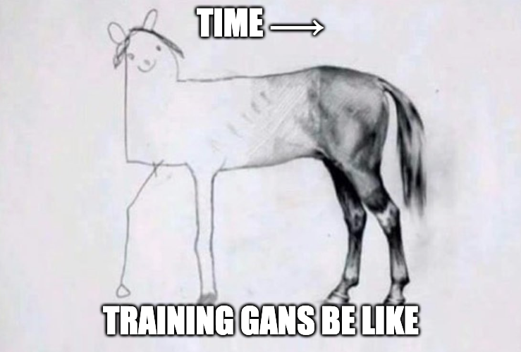

# Computer Science Communication

- Student Name: Abhishek Moturu
- Student #: 1001019925

## Sharing

I will post the image along with an explanation on my personal twitter [@AbhishekMoturu](https://twitter.com/AbhishekMoturu) and am comfortable being retweeted by [@ProbablyLearn](https://twitter.com/ProbablyLearn).

## Generative Adversarial Networks (GANs)

### Memes

Source: [Meme Generator](https://imgflip.com/i/558lk5)

This image is a representation of how the 2-player minimax game between the Generator and Discriminator in a GAN (in this case, trained using a dataset of pencil sketches of horses) looks like. The Generator initially performs very poorly and the Discriminator can easily tell the difference between a real image (from the training data distribution) and a fake image (created by the Generator, which maps from a latent space to an image space). Over time, as we train the GAN, the images generated by the Generator become essentially indistinguishable from those in the training data distribution, i.e. the Discriminator can no longer tell the difference between a real image and a fake image. We see this depicted above as the horse drawing improves over time.

Source: [Meme Generator](https://imgflip.com/i/559d8n) (My thanks to Sasha Doubov for inspiring me.)

In a similar line of thought as in the previous image, this image is a representation of the state of a GAN after successful training, once a unique solution is found. The Generator is able to generate images that perfectly match those in the training data distribution. So, at the end, the Discriminator will no longer be able to tell the difference between a real image (from the training data distribution) and a generated image (from the Generator). We see this depicted above as the real image and the generated image being "the same picture".

### Technical Explanation

Using an adversarial approach, generative models can be estimated using GANs by simultaneously training (i.e. playing a 2-player minimax) with 2 models: a Generator and a Discriminator. While a Generator tries to emulate the training data distribution, the Discriminator guesses whether a given image comes from the training data distribution or from the Generator. The idea is that, over the course of training, the Generator goes from performing very poorly to very well and the Discriminator goes from performing very well to very poorly. This translates to the Generator being able to generate very good samples that seem like they could be from the training data distribution, by the end of training the GAN.

The exact formulation of the 2-player minimax game between the Generator (G) and Discriminator (D) is as follows:

Note that the first term of the value function `V(D,G)` is the log probability of `x` being from the training data rather than being generated by the Generator. The second term of the value function is the log probability of `G(z)`, where `z` is from the latent space used to generate `G(z)`, being generated by the Generator rather than being from the training data. Since we minimize with respect to G and maximize with respect to D, this means that .

Since the first paper on GANs in 2014, there have been many applications of GANs in the fields of [facial image generation](https://arxiv.org/abs/1812.04948), [fashion design](https://arxiv.org/abs/2007.10947), [medical image generation and anomaly detection](https://arxiv.org/abs/2006.00727), [3D object generation](http://3dgan.csail.mit.edu/papers/3dgan_nips.pdf), [super-resolution](https://arxiv.org/abs/1609.04802), and [astrophysics](https://arxiv.org/abs/1702.00403), to name a few.

Source: [Generative Adversarial Nets](https://arxiv.org/abs/1406.2661)
