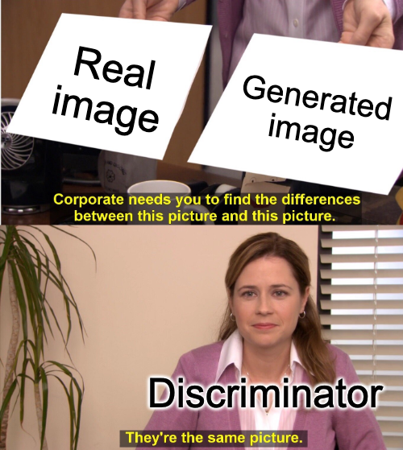

# Computer Science Communication

- Student Name: Abhishek Moturu
- Student #: 1001019925

## Sharing

I will post the image along with an explanation on my personal twitter [@AbhishekMoturu](https://twitter.com/AbhishekMoturu) and am comfortable being retweeted by [@ProbablyLearn](https://twitter.com/ProbablyLearn).

## Generative Adversarial Networks (GANs)

Source: [Meme Generator](https://imgflip.com/i/558lk5)

This image is a representation of how the minimax two-player game between the Generator and Discriminator in a GAN (trained using a dataset of pencil sketches of horses) looks like. The Generator initially performs very poorly and the Discriminator is easily able to tell the difference between a real image (from the training data distribution) and a fake image (generated by the Generator). Over time, as we train the GAN, the images generated by the Generator become essentially indistinguishable from those in the training data distribution, i.e. the Discriminator can no longer tell the difference between a real image and a fake image. We see this depicted as the horse drawing gets better and better over time.

Source: [Meme Generator](https://imgflip.com/i/559d8n) (My thanks to Sasha Doubov for inspiring me.)

This image is a
